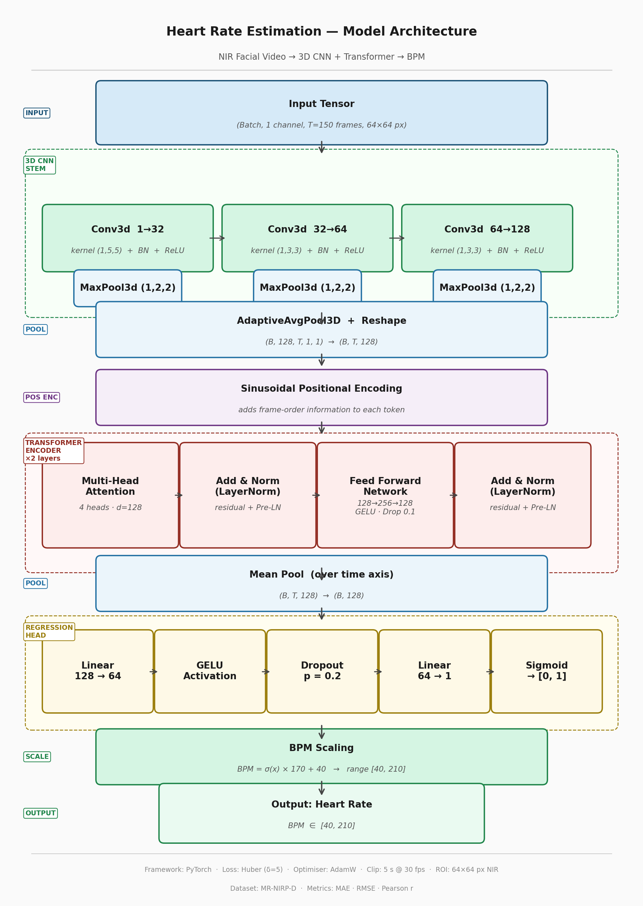

# Heart Rate Estimation from NIR Facial Video

A deep learning pipeline for contact-free heart rate (BPM) estimation from Near-Infrared facial video clips, trained on the **MR-NIRP-D** dataset.

---

## Overview

The model predicts heart rate by detecting subtle, periodic changes in facial skin reflectance caused by blood flow in NIR grayscale video. A hybrid **3D CNN + Transformer** architecture captures both spatiotemporal patterns and long-range periodic structure across 5-second video clips.

---

## Architecture

```
Input (B, 1, T=150, 64, 64)
        ↓
3D CNN Stem  [Conv3d → BN → ReLU] × 3  +  MaxPool3d × 3
        ↓
AdaptiveAvgPool3d  →  (B, T, 128)
        ↓
Sinusoidal Positional Encoding
        ↓
TransformerEncoder  [2 layers, 4 heads, d_model=128, FFN=256]
        ↓
Mean Pool over time
        ↓
Linear(128→64) → GELU → Dropout(0.2) → Linear(64→1)
        ↓
Sigmoid → scale to [40, 210] BPM
```



---

## Dataset

**MR-NIRP-D** — subjects in a driving scenario with large head motion.

| Item | Details |
|------|---------|
| Video | PGM frames (grayscale NIR, 30 fps) |
| Reference | `pulseOx.mat` — pulse oximeter signal (~60 Hz) |
| Clip Length | 150 frames (5 s) |
| Stride | 30 frames |
| ROI Size | 64 × 64 px (face crop) |

---

## Ground Truth Pipeline

Raw pulse oximeter signal → **bandpass filter** (0.7–3.5 Hz, Butterworth 2nd order) → **peak detection** (min distance 0.3 s) → BPM = 60 / mean(IBI). Falls back to Welch PSD dominant frequency if fewer than 2 peaks detected. Labels clipped to [40, 210] BPM.

---

## Training

| Setting | Value |
|---------|-------|
| Loss | Huber Loss (δ = 5 BPM) |
| Optimiser | AdamW (lr=1e-3, wd=1e-4) |
| Scheduler | CosineAnnealingLR (T_max=10, η_min=1e-5) |
| Batch Size | 4 |
| Gradient Clipping | max norm = 1.0 |
| Early Stopping | patience = 10 epochs (val MAE) |

Train / Val / Test split is **chronological** (70% / 15% / 15%) to prevent temporal data leakage.

---

## Evaluation Metrics

| Metric | Description |
|--------|-------------|
| **MAE** | Mean Absolute Error between predicted and ground truth BPM |
| **RMSE** | Root Mean Square Error (penalises large outliers) |
| **Pearson r** | Linear correlation between predicted and ground truth HR |

---

## Project Structure

```
.
├── heart_rate.ipynb          # Main notebook (data → train → eval)
├── data/
│   └── raw/Subject1/         # NIR.zip + PulseOx/pulseOx.mat
├── data/processed/           # Extracted sample frames
└── outputs/
    ├── best_model.pth        # Best checkpoint (lowest val MAE)
    ├── training_plot.png     # Loss & MAE curves
    └── eval_plots.png        # Scatter + error histogram
```

---

## Quick Start

```bash
# 1. Install dependencies
pip install torch torchvision opencv-python scipy numpy matplotlib seaborn

# 2. Set paths in the notebook
NIR_ZIP    = "data/raw/Subject1/.../NIR.zip"
PULSE_MAT  = "data/raw/Subject1/.../PulseOx/pulseOx.mat"

# 3. Run all cells in heart_rate.ipynb
```

---

## Requirements

- Python 3.8+
- PyTorch 1.12+
- OpenCV (`cv2`)
- SciPy, NumPy, Matplotlib, Seaborn

---

## Limitations

- Trained on a **single subject / session** — generalisation to other subjects is untested.
- Haar cascade face detection can fail under large head motion (fallback to last known bbox).
- Overlapping clips create temporally correlated training examples.

## Next Steps

- Multi-subject evaluation with leave-one-subject-out cross-validation.
- Replace Haar cascade with MediaPipe or RetinaFace for robust NIR face detection.
- Signal-level rPPG supervision (predict pulse waveform before BPM conversion).
- Pretrained video backbone (SlowFast, R3D) with fine-tuning.

---

## References

1. MR-NIRP-D Dataset
2. Yu et al. (2019). *Remote Photoplethysmograph Signal Measurement from Facial Videos Using Spatio-Temporal Networks.* BMVC.
3. Liu et al. (2020). *Multi-Task Temporal Shift Attention Networks for On-Device Contactless Vitals Measurement.* NeurIPS.
